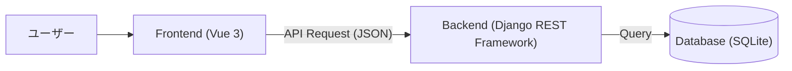
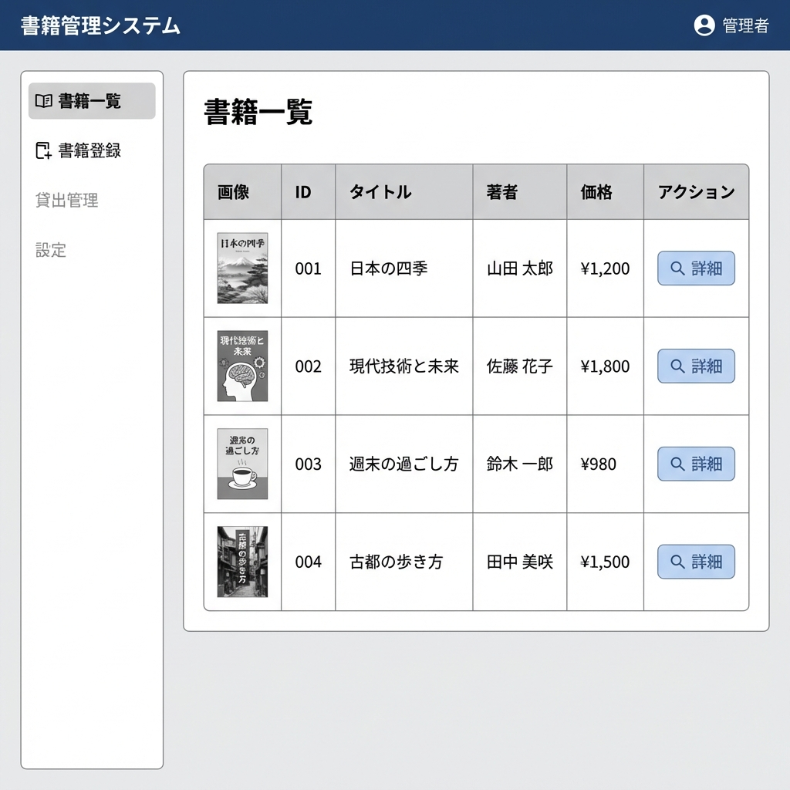
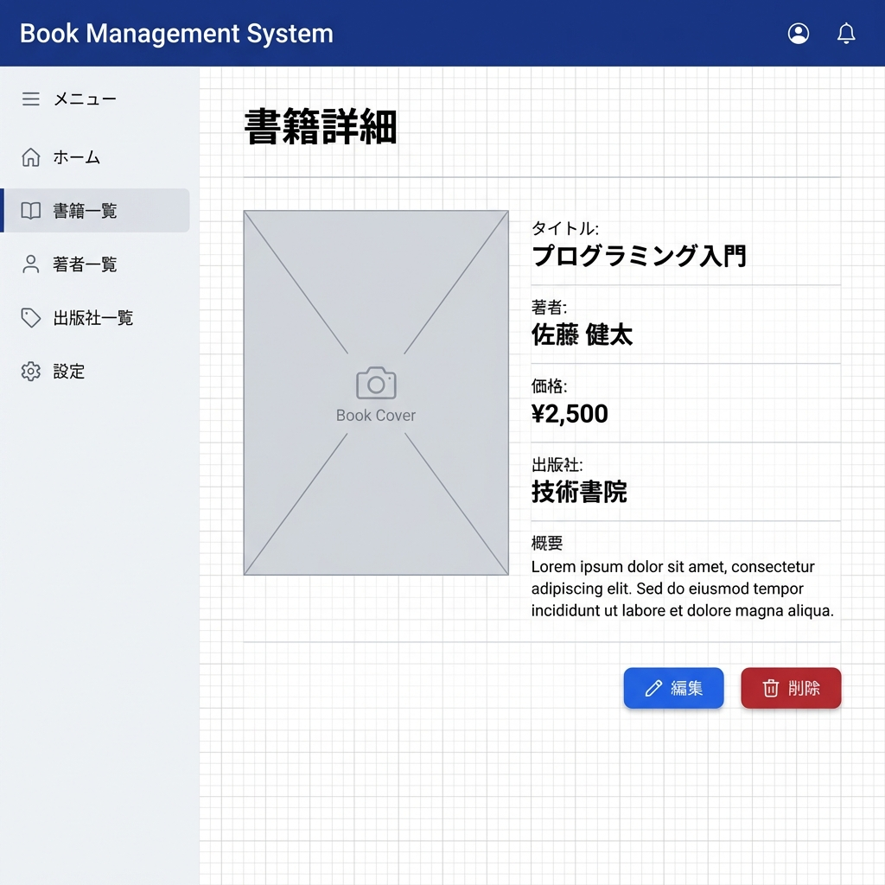
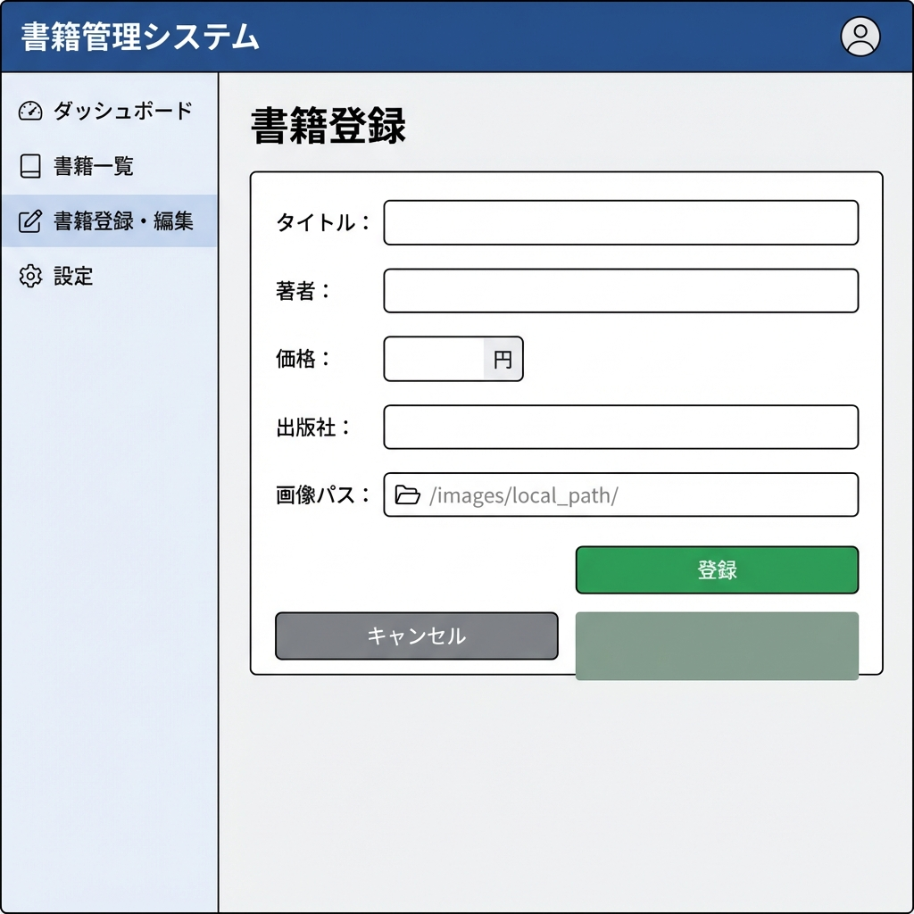

# 書籍管理システム 基本設計書

**バージョン**: v1.0.1  
**作成日**: 2026/01/27

## 1. アーキテクチャ構成
本システムは、FrontendとBackendを分離したSPA（Single Page Application）構成とする。



## 2. データベース設計

### 2.1 テーブル定義: books
書籍情報を格納するテーブル。

| カラム名 | 論理名 | データ型 | 制約 | 説明 |
| --- | --- | --- | --- | --- |
| id | ID | Integer | PK, AutoIncrement | システム内での一意な識別子 |
| title | 書籍名 | CharField | max_length=255, Not Null | |
| author | 著者名 | CharField | max_length=255, Not Null | |
| price | 価格 | Integer | Not Null | |
| publisher | 出版社 | CharField | max_length=255, Nullable | |
| image_path | 画像パス | CharField | max_length=255, Nullable | |

## 3. API設計 (RESTful API)

| メソッド | エンドポイント | 概要 | リクエストパラメータ | レスポンス |
| --- | --- | --- | --- | --- |
| GET | `http://localhost:8001/api/books/` | 書籍一覧取得 | `keyword` (optional): 書籍名検索 | 書籍オブジェクト配列 |
| POST | `http://localhost:8001/api/books/` | 書籍新規登録 | `title`, `author`, `price`, `publisher`, `image_path` | 作成された書籍オブジェクト |
| GET | `http://localhost:8001/api/books/{id}/` | 書籍詳細取得 | - | 書籍オブジェクト |
| PUT/PATCH | `http://localhost:8001/api/books/{id}/` | 書籍更新 | (変更項目) | 更新後の書籍オブジェクト |
| DELETE | `http://localhost:8001/api/books/{id}/` | 書籍削除 | - | 204 No Content |

## 4. Frontend画面設計

### 4.1 画面一覧
1. **書籍一覧画面 (BookListView)**
   - 全書籍をリスト形式（またはカード形式）で表示。
   - 検索バーを上部に配置。
   - 「新規登録」ボタンを配置。

2. **書籍詳細画面 (BookDetailView)**
   - 選択した書籍の詳細情報を表示。
   - 編集・削除アクションへの導線のみ配置。

3. **書籍登録・編集画面 (BookEditView / NewBookView)**
   - 書籍情報の入力フォーム。
   - 必須項目のバリデーションを行う。

### 4.2 ディレクトリ構成案
```
frontend/src/views/
  ├── BookListView.vue
  ├── BookDetailView.vue
  ├── BookEditView.vue
  └── NewBookView.vue
```

### 4.3 画面レイアウト・構成
基本レイアウトは `App.vue` にて定義し、ヘッダー・サイドバー・フッターを共通コンポーネントとして配置する。
メインコンテンツ部分のみ `RouterView` で切り替える構成とする。

**レイアウト構成図:**

### 4.3 画面詳細・遷移定義

#### 4.3.1 書籍一覧画面 (BookListView)
- **機能**: 全書籍を一覧表示する。初期画面として表示される。
- **表示項目**: 画像（サムネイル）、ID、書籍名、著者名、価格、詳細ボタン。
- **アクション**:
    - 「詳細」ボタン: その書籍の詳細画面 (`/books/:id`) へ遷移。
    - 「新規登録」メニュー: 新規登録画面 (`/books/new`) へ遷移。
- **画像**: ローカルに保存された画像パス (`public/images/xxx.png`) を参照して表示。

**画面イメージ:**


#### 4.3.2 書籍詳細画面 (BookDetailView)
- **機能**: 特定の書籍の詳細情報を表示する。
- **表示項目**: 書籍画像（大）、タイトル、著者名、価格、出版社、概要（もしあれば）。
- **アクション**:
    - 「編集」ボタン: 編集画面 (`/books/:id/edit`) へ遷移。
    - 「削除」ボタン: 削除確認ダイアログを表示し、OKなら削除実行後、一覧画面へ戻る。
    - 「戻る」等のナビゲーション: 一覧画面へ戻る。

**画面イメージ:**


#### 4.3.3 書籍登録・編集画面 (NewBookView / BookEditView)
- **機能**: 書籍の新規登録、および既存書籍情報の編集を行う。
- **入力項目**:
    - タイトル (必須)
    - 著者名 (必須)
    - 価格 (必須, 数値)
    - 出版社 (任意)
    - 画像パス (任意, テキスト入力): ローカル画像のパスを指定（例: `images/1001.png`）。
- **アクション**:
    - 「登録/保存」ボタン: 入力内容を検証し、DBに保存。成功後は一覧または詳細画面へ遷移。
    - 「キャンセル」ボタン: 保存せずに元の画面へ戻る。

**画面イメージ:**

