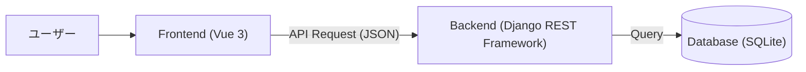

# 書籍管理システム 基本設計書

**バージョン**: v1.0.1  
**作成日**: 2026/01/27

## 1. アーキテクチャ構成
本システムは、FrontendとBackendを分離したSPA（Single Page Application）構成とする。



## 2. データベース設計

### 2.1 テーブル定義: books
書籍情報を格納するテーブル。

| カラム名 | 論理名 | データ型 | 制約 | 説明 |
| --- | --- | --- | --- | --- |
| id | ID | Integer | PK, AutoIncrement | システム内での一意な識別子 |
| title | 書籍名 | CharField | max_length=255, Not Null | |
| author | 著者名 | CharField | max_length=255, Not Null | |
| price | 価格 | Integer | Not Null | |
| publisher | 出版社 | CharField | max_length=255, Nullable | |
| image_path | 画像パス | CharField | max_length=255, Nullable | |

## 3. API設計 (RESTful API)

| メソッド | エンドポイント | 概要 | リクエストパラメータ | レスポンス |
| --- | --- | --- | --- | --- |
| GET | `/api/books/` | 書籍一覧取得 | `keyword` (optional): 書籍名検索 | 書籍オブジェクト配列 |
| POST | `/api/books/` | 書籍新規登録 | `title`, `author`, `price`, `publisher`, `image_path` | 作成された書籍オブジェクト |
| GET | `/api/books/{id}/` | 書籍詳細取得 | - | 書籍オブジェクト |
| PUT/PATCH | `/api/books/{id}/` | 書籍更新 | (変更項目) | 更新後の書籍オブジェクト |
| DELETE | `/api/books/{id}/` | 書籍削除 | - | 204 No Content |

## 4. Frontend画面設計

### 4.1 画面一覧
1. **書籍一覧画面 (BookListView)**
   - 全書籍をリスト形式（またはカード形式）で表示。
   - 検索バーを上部に配置。
   - 「新規登録」ボタンを配置。

2. **書籍詳細画面 (BookDetailView)**
   - 選択した書籍の詳細情報を表示。
   - 編集・削除アクションへの導線のみ配置。

3. **書籍登録・編集画面 (BookEditView / NewBookView)**
   - 書籍情報の入力フォーム。
   - 必須項目のバリデーションを行う。

### 4.2 ディレクトリ構成案
```
frontend/src/views/
  ├── BookListView.vue
  ├── BookDetailView.vue
  ├── BookEditView.vue
  └── NewBookView.vue
```

### 4.3 画面レイアウト・構成
基本レイアウトは `App.vue` にて定義し、ヘッダー・サイドバー・フッターを共通コンポーネントとして配置する。
メインコンテンツ部分のみ `RouterView` で切り替える構成とする。

**レイアウト構成図:**
```
+-------------------------------------------------------+
|                 ヘッダー (HeaderMenu)                 |
+-------------------+-----------------------------------+
| サイドバー        | メインコンテンツ                  |
| (SideMenu)        | (RouterView)                      |
|                   |                                   |
| - 書籍一覧        | [ ここが画面ごとに切り替わる ]    |
| - 書籍登録        |                                   |
|                   |                                   |
+-------------------+-----------------------------------+
|                 フッター (FooterInfo)                 |
+-------------------------------------------------------+
```

**各コンポーネントの役割:**
1.  **HeaderMenu.vue**: アプリケーション名（「書籍管理システム」）を表示。
2.  **SideMenu.vue**: 画面遷移のためのメニューリンクを配置。
    -   書籍一覧 (`/books`)
    -   書籍登録 (`/books/new`)
3.  **FooterInfo.vue**: コピーライト表記等を配置。

**初期画面の挙動:**
-   **ログイン機能**: なし。
-   **ルートパス (`/`)**: アプリケーションにアクセスした際は、自動的に「書籍一覧画面 (`/books`)」へリダイレクト、または一覧画面を表示する。デフォルトのランディングページは「書籍一覧」とする。
